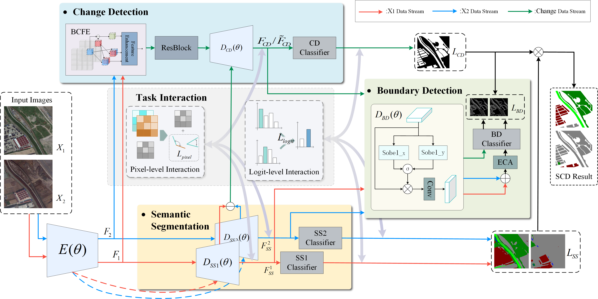

# BT-SCD

## A Semantic Change Detection Network Based on Boundary Detection and Task Interaction for High-Resolution Remote Sensing Images (TNNLS2025)

This repository is the official implementation:
> [A Semantic Change Detection Network Based on Boundary Detection and Task Interaction for High-Resolution Remote Sensing Images](https://ieeexplore.ieee.org/document/11015343)  
> Yingjie Tang, Shou Feng, Chunhui Zhao, Yongqi Chen, Zhiyong Lv, Weiwei Sun

## 📄 Abstract

Semantic change detection (CD) not only helps pinpoint the locations where changes occur, but also identifies the specific types of changes in land cover and land use. Currently, the mainstream approach for semantic CD (SCD) decomposes the task into semantic segmentation (SS) and CD tasks. Although these methods have achieved good results, they do not consider the incentive effect of task correlation on the entire model. Given this issue, this article further elucidates the SCD task through the lens of multitask learning theory and proposes a semantic change detection network based on boundary detection and task interaction (BT-SCD). In BT-SCD, the boundary detection (BD) task is introduced to enhance the correlation between the SS task and the CD task in SCD, thereby promoting positive reinforcement between SS and CD tasks. Furthermore, to enhance the communication of information between the SS and CD tasks, the pixel-level interaction strategy and the logit-level interaction strategy are proposed. Finally, to fully capture the temporal change information of the bitemporal features and eliminate their temporal dependency, a bidirectional change feature extraction module is proposed. Extensive experimental results on three commonly used datasets and a nonagriculturalization dataset (NAFZ) show that our BTSCD achieves state-of-the-art performance.

## 🎮 Framework


## 📧 Contact

If you have any issues while using the project, please feel free to contact me: [tangyj@hrbeu.edu.cn](tangyj@hrbeu.edu.cn).

## 📚 Citation

If you find our work useful, please consider citing our paper:

```bibtex
@ARTICLE{11015343,
  author={Tang, Yingjie and Feng, Shou and Zhao, Chunhui and Chen, Yongqi and Lv, Zhiyong and Sun, Weiwei},
  journal={IEEE Transactions on Neural Networks and Learning Systems}, 
  title={A Semantic Change Detection Network Based on Boundary Detection and Task Interaction for High-Resolution Remote Sensing Images}, 
  year={2025},
  volume={},
  number={},
  pages={1-15},
  doi={10.1109/TNNLS.2025.3570425}
}

```

## 📜 License

Licensed under a [Creative Commons Attribution-NonCommercial 4.0 International](https://creativecommons.org/licenses/by-nc/4.0/) for Non-commercial use only.
Any commercial use should get formal permission first.
